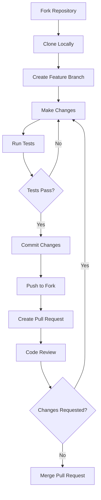

# Contributing to HomeVista

We're thrilled that you're interested in contributing to HomeVista! This document provides guidelines and instructions for contributing to the project.

## Table of Contents

1. [Code of Conduct](#code-of-conduct)
2. [Getting Started](#getting-started)
3. [Development Workflow](#development-workflow)
4. [Submitting Changes](#submitting-changes)
5. [Coding Standards](#coding-standards)
6. [Testing](#testing)
7. [Documentation](#documentation)
8. [Community](#community)

## Code of Conduct

By participating in this project, you agree to abide by our [Code of Conduct](CODE_OF_CONDUCT.md). Please read it before contributing.

## Getting Started

1. Fork the repository on GitHub.
2. Clone your fork locally:
   ```
   git clone https://github.com/your-username/homevista.git
   ```
3. Install dependencies:
   ```
   cd homevista
   npm install
   ```
4. Create a new branch for your feature or bug fix:
   ```
   git checkout -b feature/your-feature-name
   ```

## Development Workflow

1. Make your changes in the new branch.
2. Run the development server to test your changes:
   ```
   npm run dev
   ```
3. Ensure your code follows the project's coding standards (run linter):
   ```
   npm run lint
   ```
4. Write or update tests for your changes.
5. Run the test suite to ensure all tests pass:
   ```
   npm test
   ```

## Submitting Changes

1. Commit your changes with a clear and descriptive commit message:
   ```
   git commit -m "Add feature: description of your changes"
   ```
2. Push your branch to your fork:
   ```
   git push origin feature/your-feature-name
   ```
3. Create a pull request from your fork to the main HomeVista repository.
4. In the pull request description, explain your changes and the problem they solve.

## Coding Standards

We use ESLint and Prettier to maintain consistent code style. Please ensure your code adheres to these standards:

- Use TypeScript for all new files.
- Follow the existing code style in the project.
- Use meaningful variable and function names.
- Write comments for complex logic or non-obvious code.

## Testing

- Write unit tests for new functions and components.
- Update existing tests if your changes affect them.
- Aim for high test coverage for critical parts of the application.

## Documentation

- Update the README.md file if your changes introduce new features or change existing functionality.
- Document new components, hooks, or utilities with JSDoc comments.
- Update the USER_MANUAL.md file if your changes affect user interactions.

## Community

Join our community channels to discuss ideas, ask questions, or get help:

- [Discord Server](https://discord.gg/homevista)
- [GitHub Discussions](https://github.com/your-username/homevista/discussions)

## Contribution Workflow



Thank you for contributing to HomeVista! Your efforts help make this project better for everyone.