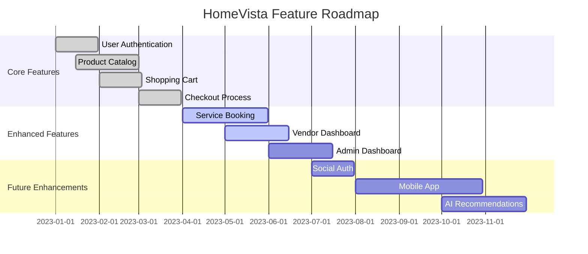

# HomeVista Features

This document provides a comprehensive list of features available in the HomeVista platform.

## Table of Contents

1. [User Features](#user-features)
2. [Product Features](#product-features)
3. [Service Features](#service-features)
4. [Admin Features](#admin-features)
5. [Vendor Features](#vendor-features)
6. [Technical Features](#technical-features)

## User Features

### Authentication and Profile Management
- User registration and login
- Social media authentication (planned feature)
- Profile creation and management
- Address management for shipping and billing

### Shopping Experience
- Browse products by category
- Search products with filters (price, rating, color, etc.)
- View product details, including images, descriptions, and specifications
- Add products to cart
- Manage shopping cart (add, remove, update quantities)
- Checkout process with multiple payment options
- Order history and tracking

### Service Booking
- Browse available services
- Search services with filters (category, price, rating, etc.)
- View service details, including provider information and portfolio
- Request quotes for custom services
- Book services with available time slots
- Service history and feedback

## Product Features

### Product Catalog
- Categorized product listings
- Product search and filtering
- Product details page with multiple images, descriptions, and specifications
- Related products suggestions

### Dynamic Pricing and Promotions
- Support for regular and discounted prices
- Flash deals with countdown timers
- Bulk purchase discounts (planned feature)

### Product Reviews and Ratings
- Customer reviews and ratings for products
- Helpful vote system for reviews (planned feature)

## Service Features

### Service Catalog
- Categorized service listings
- Service search and filtering
- Service details page with provider information and portfolio

### Quotation System
- Request for quotations on custom services
- Quotation contest for competitive bidding

### Service Provider Profiles
- Detailed profiles for service providers
- Portfolio showcase
- Customer reviews and ratings for services

## Admin Features

### Dashboard
- Overview of sales, orders, and user statistics
- Revenue reports and analytics

### Product and Service Management
- Add, edit, and remove products and services
- Manage categories and attributes

### User Management
- View and manage user accounts
- Handle user roles and permissions

### Order Management
- View and process orders
- Manage refunds and returns

## Vendor Features

### Vendor Dashboard
- Overview of sales and order statistics
- Manage product and service listings

### Inventory Management
- Track product inventory
- Set up low stock alerts

### Order Fulfillment
- View and process incoming orders
- Manage shipping and delivery

### Analytics and Reporting
- Sales reports and performance analytics
- Customer insights

## Technical Features

### Responsive Design
- Mobile-first approach
- Consistent experience across devices

### Performance Optimization
- Lazy loading of components and images
- Efficient state management with React hooks

### Security
- Secure authentication with Firebase
- Data encryption for sensitive information

### Scalability
- Modular architecture for easy feature additions
- Cloud-based backend for scalable operations

### Developer Experience
- TypeScript for improved code quality and developer productivity
- Vite for fast development and building
- Tailwind CSS for rapid UI development

## Feature Roadmap

This roadmap provides an overview of completed, ongoing, and planned feature developments for HomeVista.