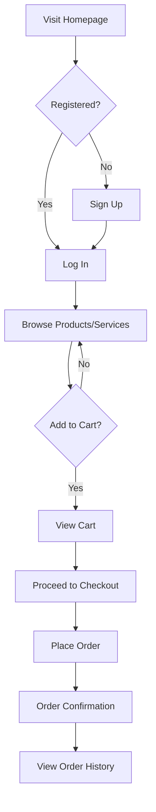

# HomeVista User Manual

Welcome to HomeVista! This user manual will guide you through the features and functionality of our platform.

## Table of Contents

1. [Getting Started](#getting-started)
2. [Browsing Products](#browsing-products)
3. [Shopping Cart](#shopping-cart)
4. [Checkout Process](#checkout-process)
5. [User Account](#user-account)
6. [Service Booking](#service-booking)
7. [Vendor Dashboard](#vendor-dashboard)
8. [Admin Dashboard](#admin-dashboard)
9. [Troubleshooting](#troubleshooting)

## Getting Started

### Registration and Login

1. Navigate to the HomeVista homepage.
2. Click on the "Sign Up" button in the top right corner.
3. Fill in the registration form with your email and password.
4. Alternatively, you can use social media login if available.
5. Once registered, you can log in using your credentials.

### Navigation

The main navigation menu includes:

- Home
- Shop (Products)
- Services
- Cart
- User Account

## Browsing Products

### Product Categories

1. Click on "Shop" in the main navigation.
2. Use the category sidebar to browse different product types.
3. Click on a category to view all products within it.

### Search and Filters

1. Use the search bar at the top of the page to find specific products.
2. Apply filters such as price range, color, or rating to refine your search.

### Product Details

1. Click on a product to view its detailed page.
2. Here you can find:
   - Product images (click to enlarge)
   - Description and specifications
   - Price and any discounts
   - Color options (if available)
   - Add to Cart button

## Shopping Cart

### Adding Items

1. On a product page, select the desired quantity and click "Add to Cart".
2. The cart icon in the header will update with the number of items.

### Managing Cart

1. Click on the cart icon to view your current items.
2. Adjust quantities or remove items as needed.
3. View the subtotal and proceed to checkout when ready.

## Checkout Process

1. From the cart page, click "Proceed to Checkout".
2. Fill in or select your shipping address.
3. Choose a payment method.
4. Review your order summary.
5. Click "Place Order" to complete your purchase.

## User Account

### Profile Management

1. Click on your username in the top right corner.
2. Select "Profile" from the dropdown menu.
3. Here you can update your personal information and password.

### Order History

1. In your account dashboard, click on "Order History".
2. View details of past orders and their current status.

## Service Booking

### Browsing Services

1. Click on "Services" in the main navigation.
2. Browse available services or use filters to find specific types.

### Requesting a Quote

1. On a service page, click "Request a Quote".
2. Fill in the form with your project details.
3. Submit the request and wait for providers to respond.

### Booking a Service

1. Once you've received and accepted a quote, click "Book Now".
2. Select your preferred date and time.
3. Confirm the booking and make any required payments.

## Vendor Dashboard

For service providers and product sellers:

1. Log in to your vendor account.
2. Access the dashboard to manage your listings, orders, and analytics.
3. Add new products or services using the provided forms.
4. Respond to customer inquiries and quote requests.

## Admin Dashboard

For platform administrators:

1. Log in with your admin credentials.
2. Access the admin dashboard to manage users, products, and services.
3. View site-wide analytics and generate reports.
4. Manage system settings and configurations.

## Troubleshooting

### Common Issues and Solutions

1. **Can't log in**: 
   - Ensure your email and password are correct.
   - Try resetting your password.

2. **Product won't add to cart**: 
   - Check if the product is in stock.
   - Clear your browser cache and try again.

3. **Payment failure**: 
   - Verify your payment information is correct.
   - Ensure your payment method has sufficient funds.

### Contact Support

If you encounter any issues not covered here, please contact our support team:

- Email: support@homevista.com
- Phone: 1-800-HOMEVISTA
- Live Chat: Available on the website during business hours

## User Journey

This diagram illustrates the typical user journey from visiting the homepage to placing an order.

We hope this user manual helps you make the most of HomeVista. Happy shopping and decorating!